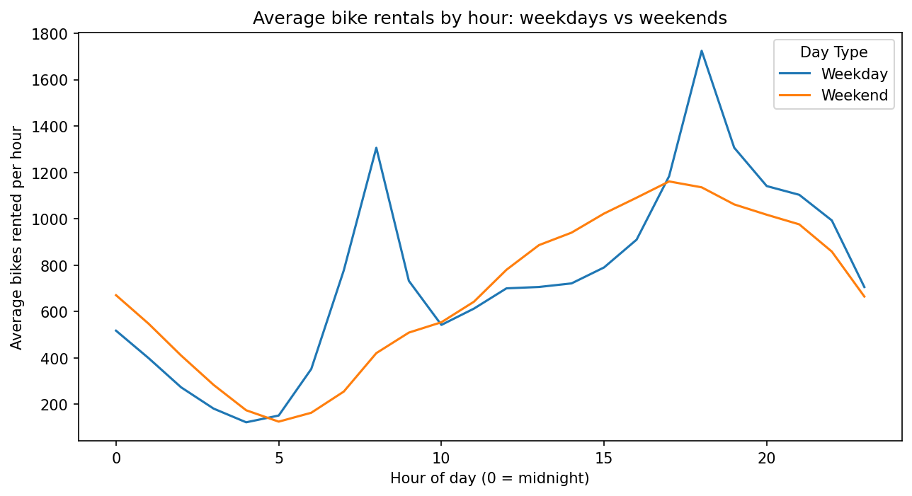
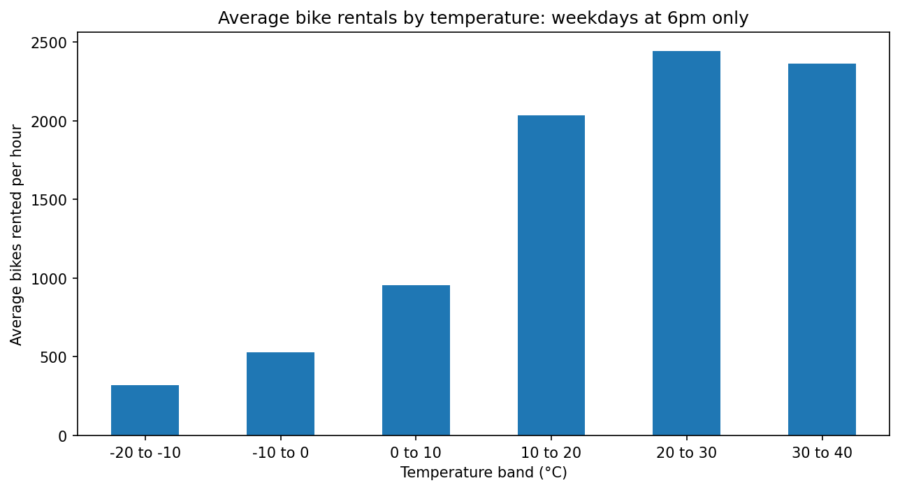
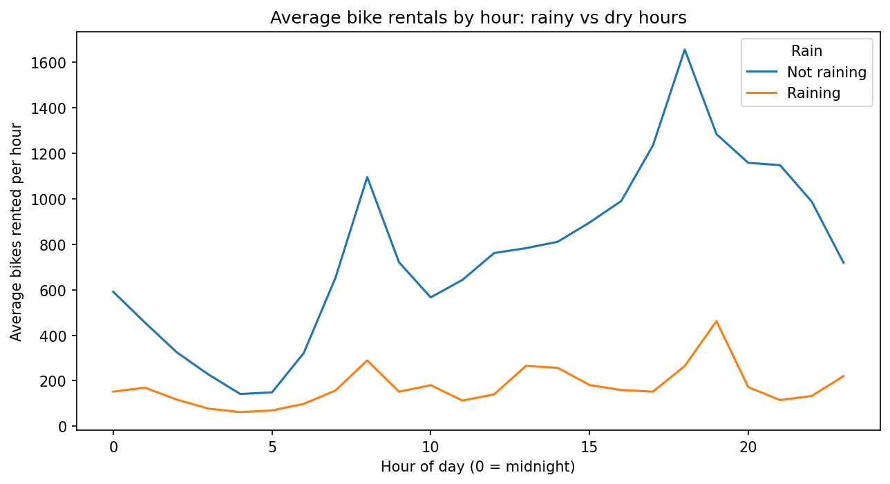

# When Do People Ride Seoul's Public Bikes?
### How time of day and weather affect Ttareungyi (따릉이) rentals

## The question
Living in Seoul, I noticed that people seem to ride public bikes not just to get to work, but also for exercise when the weather is nice. Seoul's public bike system, Ttareungyi (따릉이), needs to know when people are most likely to rent bikes, so bikes are available when people need them. In this project, I wanted to find out what time of day people rent the most bikes, and whether weather, like temperature and rain, affects it.

## The data
- **Source:** Seoul Bike Sharing Demand dataset, UCI Machine Learning Repository (https://doi.org/10.24432/C5F62R)
- **Licence:** CC BY 4.0, which means it's free to use as long as the source is credited
- **Time period:** 1 December 2017 to 30 November 2018
- **What one row means:** one hour in Seoul, showing how many bikes were rented and the weather in that hour (8,760 hours in total)

## What I did
1. **Explored the data:** checked how big the table was and what information each column held.
2. **Cleaned the data:**
   - Removed 295 hours when the bike system was shut down. These hours showed zero rentals, which would have made demand look lower than it really was.
   - Converted the dates into a proper date format, so I could look at days of the week.
3. **Time of day:** grouped all hours into the 24 hours of the day and compared the average number of rentals. Then I compared weekdays and weekends separately, to test whether the pattern could be linked to commuting.
4. **Temperature:** sorted hours into 10-degree temperature bands and compared the average rentals. Because warm hours are usually in the afternoon, I repeated the check using only weekdays at 6pm, so the time of day stayed the same.
5. **Rain:** compared rainy and dry hours at each hour of the day, then calculated the overall difference as a percentage.

**Tools:** Python (pandas, matplotlib) in Google Colab

## Key findings

**1. Rentals peak at commuting times on weekdays.**
On weekdays, rentals have two clear peaks, around 8am and 6pm. On weekends, there are no sharp peaks, and rentals rise slowly to their highest around 4pm. This pattern is consistent with people commuting on weekdays, although the data can't show why people ride.



**2. Warmer weather means more rentals.**
Average rentals rise as the temperature gets warmer. This was still true when I compared only weekdays at 6pm, so it isn't just because warm hours happen in the afternoon.



**3. Rain cuts rentals sharply.**
Rainy hours have **78% fewer rentals** on average than dry hours, and rentals are lower during rain at every hour of the day.




**What this could mean for Ttareungyi:** The system could make sure stations are well stocked before the 8am and 6pm weekday peaks. Quiet early-morning hours (around 4–5am) may be a good time for repairs. Since this dataset has no location information, a useful next step would be to check with station-level data whether these peaks are concentrated around subway stations and office areas.

## Limitations
- The data shows **when** people rent bikes, not **why**. The commuting explanation is likely, but not proven.
- Warm hours also have more daylight and usually happen in summer, so temperature can't be fully separated from these.
- There are far fewer rainy hours than dry hours, and "raining" groups light drizzle and heavy rain together.
- The data covers only one year (Dec 2017 – Nov 2018) in one city, so patterns may have changed since then, especially after COVID-19 changed how people commute.

## Data ethics note
- **Who is missing:** The data only reflects people who could rent a bike. At the time, riders had to be at least 15, standard bikes may not suit people with some disabilities, and renting may have been harder for visitors and people without a smartphone or card. Their travel needs don't show up in this data.
- **Hidden demand:** The data only counts bikes that were actually rented. If a station was empty, people who wanted a bike weren't recorded. If the system added bikes only where rentals were already high, areas with too few bikes could keep looking "unpopular" and get even fewer bikes.
- **Privacy:** The data shows only hourly totals, not individual riders, so no one can be identified.

## What I'd do next
- **Use station-level data** to check whether the weekday peaks are concentrated around subway stations and office areas.
- **Use more recent data** to see whether patterns changed after COVID-19 changed how people commute.
- **Separate light and heavy rain** to see how much rain it takes to stop people riding.
- **Look for hidden demand** by checking how often stations were empty, to find areas where people wanted bikes but couldn't get one.

## How to run this project
1. Open `seoul_bike_analysis.ipynb` in Google Colab.
2. Click **Runtime → Run all**. The notebook downloads the data directly from the UCI website, so no extra files are needed.
3. To run it on your own computer instead, install the packages in `requirements.txt` first.

## Folder structure
```
seoul-bike-analysis/
├── README.md                  ← this file
├── seoul_bike_analysis.ipynb  ← all the code, notes and charts
├── requirements.txt           ← Python packages needed
└── *.png                   ← charts used in this README
```
